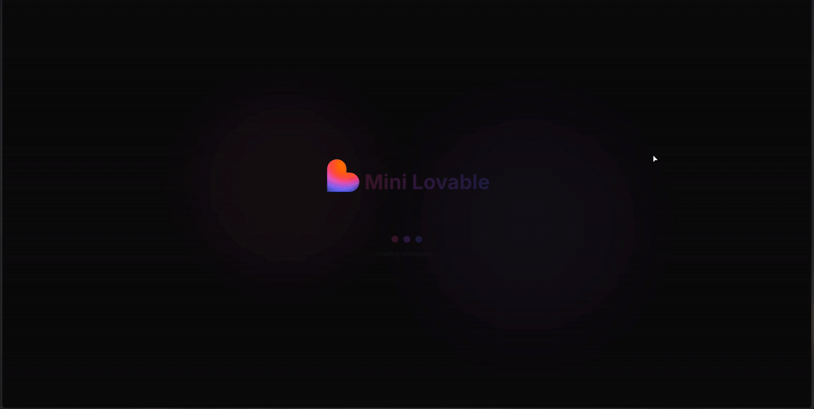

# Mini Lovable

A minimal "Lovable-style" AI coding surface with chat, file tree, code editor, live preview, and console — all running in the browser with mocked AI responses.

[](https://www.youtube.com/watch?v=WKtRpzEyE0U)

> Click the gif above to watch the full demo

## Quick Start

```bash
# Install dependencies
pnpm install

# Start development server
pnpm dev

# Run tests
pnpm test

# Build for production
pnpm build
```

Open [http://localhost:5173](http://localhost:5173) in your browser.

## Features

### Core Functionality
- **Chat-to-Code (Mocked AI)**: Send prompts like "create a react todo app" or "add filter buttons" to trigger predefined patches
- **Diff Review Modal**: Review changes before applying with Accept All / Revert options
- **Monaco Editor**: Full-featured code editor with syntax highlighting and tabs
- **Live Preview**: Real-time app preview powered by Sandpack in-browser bundler
- **Console Panel**: Streams `console.log/error` from the preview iframe
- **File Tree**: Visual file explorer with status badges (New/Modified)

### Persistence & Import/Export
- **IndexedDB Persistence**: Workspace auto-persists to browser storage
- **Export/Import**: Download/upload projects as JSON or ZIP bundles

### UX Polish
- **Resizable 3-Pane Layout**: Drag to resize Chat, Editor, and Preview panels
- **Dark/Light Theme**: Toggle via header button
- **Command Palette (⌘K)**: Quick actions and fuzzy file search
- **Keyboard Shortcuts**: See [KEYBOARD_SHORTCUTS.md](./KEYBOARD_SHORTCUTS.md)

## Architecture Decisions

### Tech Stack
| Layer | Choice | Rationale |
|-------|--------|-----------|
| Framework | Vite + React 19 + TypeScript | Fast HMR, modern React features |
| Editor | `@monaco-editor/react` | VS Code-quality editing, built-in diff support |
| Preview | `@codesandbox/sandpack-react` | Battle-tested in-browser bundler |
| State | Zustand | Minimal boilerplate, excellent DevTools |
| Styling | Tailwind CSS v4 | Utility-first, fast iteration |
| Layout | `react-resizable-panels` | Smooth resizing, persistence-ready |
| UI Components | Radix UI primitives | Accessible, unstyled, composable |

### Module Structure
```
src/
├── modules/
│   ├── fs/           # Virtual file system + IndexedDB adapter
│   ├── patches/      # Patch loader + apply engine
│   ├── editor/       # Monaco editor, tabs, diff viewer
│   ├── preview/      # Sandpack wrapper + console bridge
│   ├── chat/         # Chat UI + trigger → patch mapping
│   ├── layout/       # Panel visibility state
│   └── theme/        # Dark/light theme management
├── components/       # Shared UI components
├── hooks/            # Custom React hooks
└── lib/              # Utilities
```

### Key Design Choices

1. **Pure Patch Engine**: The patch application logic is pure and testable, decoupled from UI. Supports `create`, `update`, and `delete` operations.

2. **Console Bridge via postMessage**: Sandpack's preview iframe communicates console logs back to the host via a custom bridge script injected into the preview.

3. **Optimistic UI**: File changes are applied immediately with visual feedback; persistence happens asynchronously.

4. **Inline Rename with Context Menu**: File tree uses right-click context menu for rename/delete, with inline editing for rename operations.

## Tradeoffs

| Decision | Benefit | Cost |
|----------|---------|------|
| Mocked AI only | Deterministic, no API keys needed | No real AI capabilities |
| Full file replacement for patches | Simpler diff logic | Larger patch payloads |
| IndexedDB for persistence | Works offline, no backend | Limited to ~50MB per origin |
| Sandpack for preview | Zero config bundling | Bundle size overhead (~500KB) |
| Monaco Editor | Feature-rich | Large bundle (~2MB) |

## Mock AI Patches

Located in `/public/patches/`:

| Trigger | File | Description |
|---------|------|-------------|
| "create a react todo app" | `todo-app.json` | Scaffolds a React + Vite todo app |
| "add filter buttons" | `add-filters.json` | Adds All/Active/Done filters |
| "add localstorage" | `add-localstorage.json` | Persists todos to localStorage |
| "refactor structure" | `refactor-structure.json` | Refactors into components |

## Tests

```bash
# Run all tests
pnpm test

# Run with coverage
pnpm test -- --coverage
```

Test coverage includes:
- **Patch application** (`apply.test.ts`, `hunk.test.ts`, `loader.test.ts`)
- **Persistence** (`persistence.test.ts`, `export.test.ts`)
- **File system store** (`store.test.ts`)
- **Editor store** (`store.test.ts`)
- **Preview refresh** (`PreviewPane.test.tsx`)
- **File tree interactions** (`FileTreePane.test.tsx`)
- **Fuzzy matching** (`fuzzyMatch.test.ts`)

## Time Spent

| Phase | Hours | Notes |
|-------|-------|-------|
| Initial setup & architecture | 1.5 | Vite, Tailwind, module structure |
| File system & persistence | 2.0 | IndexedDB, import/export |
| Patch engine | 1.5 | Loader, apply logic, diff generation |
| Editor integration | 1.5 | Monaco, tabs, diff viewer |
| Preview & console | 1.0 | Sandpack, console bridge |
| Chat UI | 0.5 | Message list, trigger matching |
| UX polish | 1.5 | Command palette, shortcuts, dialogs, theme |
| Testing | 1.0 | Unit tests, integration tests |
| **Total** | **~10.5** | Slightly over 8hr target |

## Scripts

```bash
pnpm dev          # Start dev server
pnpm build        # Production build
pnpm preview      # Preview production build
pnpm test         # Run tests
pnpm lint         # ESLint
pnpm format       # Biome formatter
```

## License

MIT