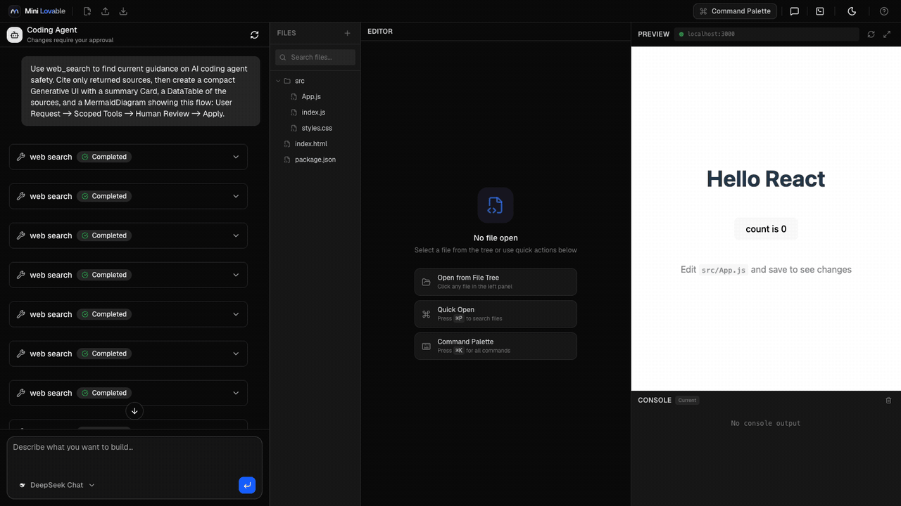
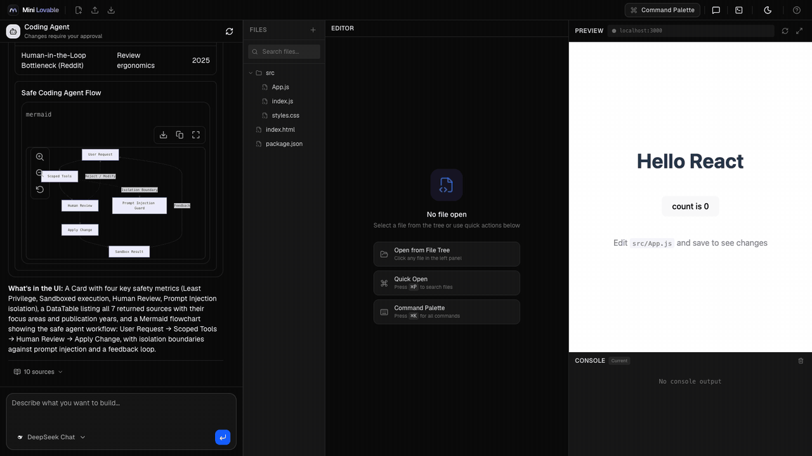
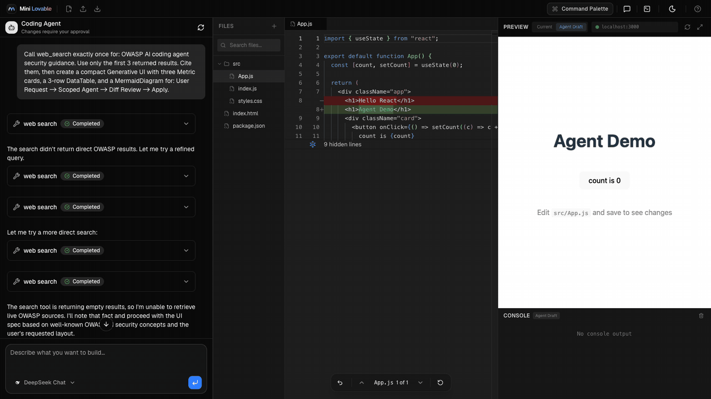

# Mini Lovable Agent Studio

一个浏览器内的 AI 编程工作台：文件树、Monaco 编辑器、Sandpack 实时预览与真实 coding agent 共享同一个 TanStack Start 应用。Agent 会在请求级隔离工作区中调用工具，最终提交结构化 ChangeSet；只有用户审核并接受后，变更才会原子写入浏览器工作区。

## Demo

### Web search

Agent 通过受限的 `web_search` 工具查询外部资料，工具调用状态与来源会按实际时序出现在消息中。



### Generative UI

研究结果可组合为受 Catalog 约束的 Metric、DataTable 和 MermaidDiagram，应用只渲染预先注册的安全组件。



### Agent code diff

Agent 变更会先进入逐 hunk diff 审核，并在用户接受前通过 Agent Draft Preview 预览结果。



## 技术栈

- TanStack Start（SPA/客户端 IDE 路由与同源 Server Routes）
- Hono（`/api/*` API、校验、请求 ID、大小限制与错误边界）
- Mastra + AI SDK v6（多步 Agent、工具循环与 UI Message Stream）
- AI Elements + shadcn/ui + Tailwind CSS v4
- Zustand + IndexedDB（浏览器工作区与持久化）
- Monaco + Sandpack（编辑、diff 与实时预览）

## 快速开始

要求 Node.js `>=22.13.0` 与 pnpm。

```bash
pnpm install
cp .env.example .env.local
pnpm dev
```

打开 [http://localhost:3000](http://localhost:3000)。至少配置一个 Provider key 后才能发送消息；未配置的 Provider 仍会出现在选择列表中，但保持禁用状态。

## Provider 配置

Key 只在服务端按请求读取，不使用 `VITE_` 前缀，也不会返回给浏览器。

| Provider | 环境变量 | 默认模型 |
|---|---|---|
| OpenAI | `OPENAI_API_KEY` | `openai/gpt-5.4` |
| Qwen / DashScope | `DASHSCOPE_API_KEY` | `alibaba-cn/qwen3-coder-plus` |
| DeepSeek | `DEEPSEEK_API_KEY` | `deepseek/deepseek-chat` |
| Anthropic | `ANTHROPIC_API_KEY` | `anthropic/claude-sonnet-4-6` |
| Google Gemini | `GOOGLE_API_KEY`、`GOOGLE_GENERATIVE_AI_API_KEY` 或 `GEMINI_API_KEY` | `google/gemini-2.5-pro` |
| Moonshot / Kimi | `MOONSHOT_API_KEY` | `moonshotai/kimi-k2.7-code` |
| xAI | `XAI_API_KEY` | `xai/grok-build-0.1` |
| OpenRouter | `OPENROUTER_API_KEY` | `openrouter/anthropic/claude-sonnet-4.6` |

每个 Provider 只开放服务端目录中审核过、支持工具调用的模型。浏览器只保存 `{ providerId, modelId }`；若已保存的选择失效，会自动回退到第一个已配置 Provider。

如需调整每个 Provider 的默认模型，可使用 `.env.example` 中的 `*_DEFAULT_MODEL` 非敏感变量；只有内置 allowlist 中的模型 ID 会生效。

## Research Tools

Agent 可按需调用两个只读研究工具：

- `web_search`：通过 Tavily basic search 查询公开网页，每次最多返回 5 条经过校验的来源。需在服务端配置 `TAVILY_API_KEY`，不要使用 `VITE_` 前缀。
- `weather_search`：通过 Open-Meteo 地理编码与天气接口查询当前天气及 1–7 日预报，无需 key。

来源会在工具执行完成时立即出现在消息时间线中；回答末尾再按 URL 去重聚合为最多 10 条的 `N sources` 列表，可 hover、键盘聚焦或点击查看。Agent 只能引用工具实际返回的 URL；搜索结果一律视为不可信参考内容，不会作为指令执行，也不得在查询中发送密钥、完整文件或私有源码。

当前 Open-Meteo 免费接口仅按非商业、本地或受控环境使用，并在每次天气结果中展示归因。商业或公开生产部署前，请改用其 [Customer API](https://open-meteo.com/en/pricing) 或满足业务许可要求的天气服务，并遵守 [Open-Meteo 许可条款](https://open-meteo.com/en/license)。

## Agent 工作流

```text
Browser workspace snapshot
        │
        ▼
POST /api/chat → Hono → Mastra coding agent
                            ├── research only → web_search / weather_search
                            │                    │
                            │                    ▼
                            │               cited answer
                            │
                            └── code change → request-scoped RunWorkspace
                                               │
                                               ▼
                                      finalize_changes
                                               │
                                               ▼
                                    file/hunk review in browser
                                      │ accept      │ reject
                                      ▼             ▼
                              Workspace.apply()   discard
```

核心约束：

- Agent 没有 shell、部署、宿主文件系统或任意网络工具；外部访问仅限服务端审核过的 Tavily 与 Open-Meteo 适配器。
- 现有文件必须先读取，才能写入或删除。
- Agent 只修改 shadow workspace，不能直接写浏览器文件。
- ChangeSet 带工作区 revision 与逐文件 hash；任何冲突都会使整次应用失败，不会部分写入。
- 接受后的事务支持一次安全 Undo；工作区若再次变化则拒绝冲突撤销。

## 工作区安全边界

发给 Agent 的快照默认最多 250 个文本文件、单文件 256 KiB、合计 2 MiB。以下内容会在浏览器预检时排除并提示：

- `.env*`、私钥、证书、凭据文件与 `.ssh`
- `node_modules`、`dist`、`.output` 等构建目录
- 二进制内容和超限文件

服务端会再次验证规范化 POSIX 路径、内容 hash、模型 allowlist 与请求结构。生产公开部署前仍应增加身份认证、用户级限流与配额；当前版本适合可信本地或受控内网环境。

## API

- `GET /api/health`：运行状态
- `GET /api/providers`：公开 Provider/模型描述及 `configured` 状态，不包含 key
- `POST /api/chat`：AI SDK v6 UI message stream

## 开发与验证

```bash
pnpm typecheck
pnpm lint
pnpm test
pnpm build
pnpm check
```

测试覆盖 Workspace 原子事务/冲突/Undo、IndexedDB v1→v2 迁移与写入合并、Provider allowlist 与密钥脱敏、RunWorkspace 安全约束、Research Gateway 边界，以及 Hono → Mastra → 工具循环 → ChangeSet 的完整流式集成。

如需对已配置的真实 Provider 做一次付费、显式启用的端到端冒烟测试，先运行应用，再执行：

```bash
SMOKE_PROVIDER_ID=openai SMOKE_MODEL_ID=openai/gpt-5.4 pnpm smoke:provider
```

未提供 `SMOKE_PROVIDER_ID` 时会使用第一个已配置 Provider；脚本不会读取或输出 key。

## 生产运行

```bash
pnpm build
pnpm start
```

构建通过 Nitro 生成 Node server 到 `.output/server/index.mjs`，静态资源位于 `.output/public`。通过 `PORT`/`HOST` 设置监听地址；运行时同样要求 Node.js `>=22.13.0`。

## 目录

```text
src/
├── routes/                 # TanStack Start 文档、客户端 IDE 与 Hono catch-all
├── server/
│   ├── agent/              # Mastra Agent、工具与请求级 RunWorkspace
│   └── providers/          # server-only ProviderCatalog
├── modules/
│   ├── agent-chat/         # Provider 选择与 ChangeSet review
│   ├── workspace/          # snapshot / preview / apply / undo 深模块
│   ├── chat/               # AI SDK + AI Elements 聊天界面
│   ├── fs/                 # 浏览器虚拟文件系统与 IndexedDB
│   ├── editor/             # Monaco 会话与 diff
│   └── preview/            # Sandpack 与 console bridge
└── components/
    ├── ai-elements/        # 按需安装的 AI Elements registry 源码
    └── ui/                 # shadcn/ui 组件
```

## License

MIT
